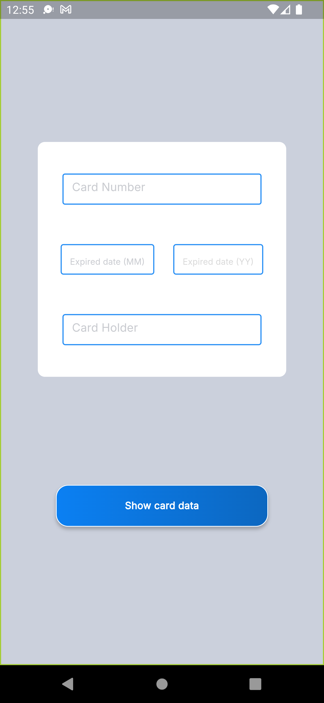
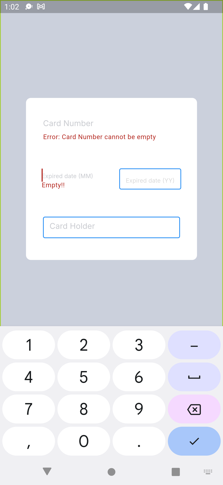
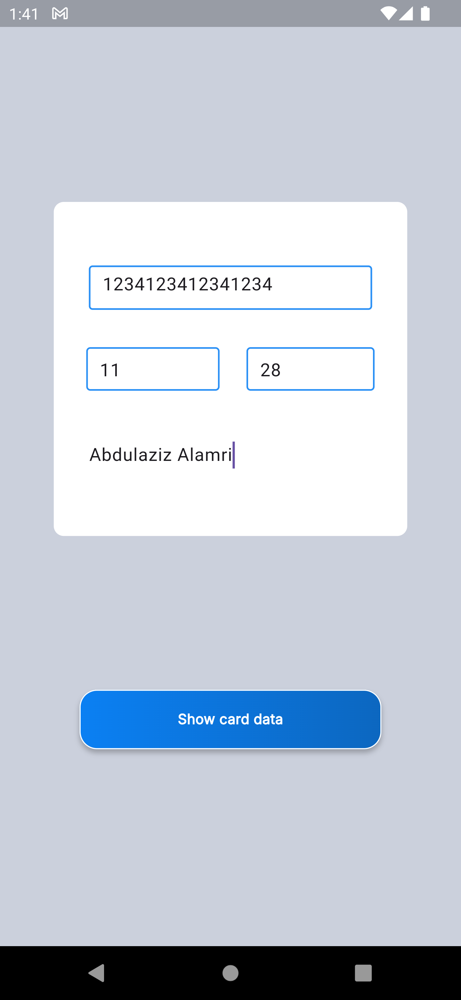
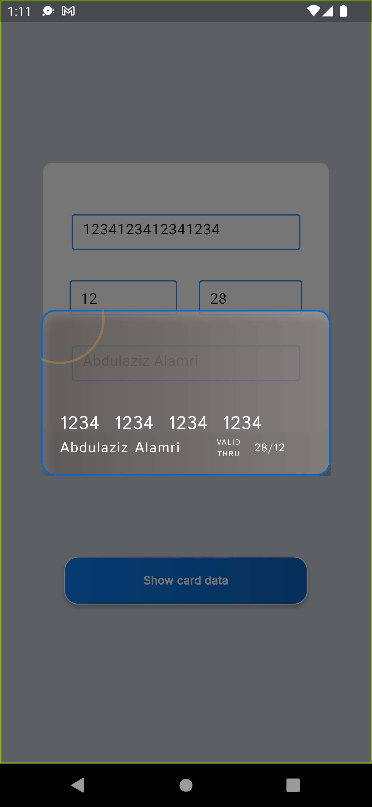

# Card Payment Method

A simple flutter project showing the UI implementation of Bank Card Registration app where users can add cards information to display

## Work

- Used TextFormFields to recieve Card information
- Validated Inputs and used Keyboard type for number-only inputs
- Used a custom widget (AlertMessage) to display Card after successfully registering it.
- Used Form key to validate all inputs before submittion (by Show Card info button)

- Issues to be fixed:

- *Code can be better, TextFormFields should be seperated into a customWidget*
- *Some of the measurements are off, by a little*
- *Could not find a way to keep TextFormField border on after user Interaction*

## UI

- Note: A video of UI is uploaded in assets/video

 

## Help
If you encounter any issues:
- Make sure you have all the necessary dart files within the project
- Contact us so that we can help resolve the problem

## Authors
Abdulaziz Alamri

## Version History
**See commits history for more details**

## Acknowledgments
Tuwaiq Academy

