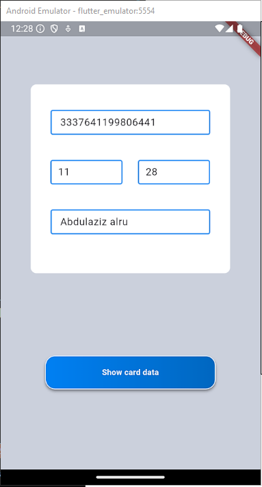
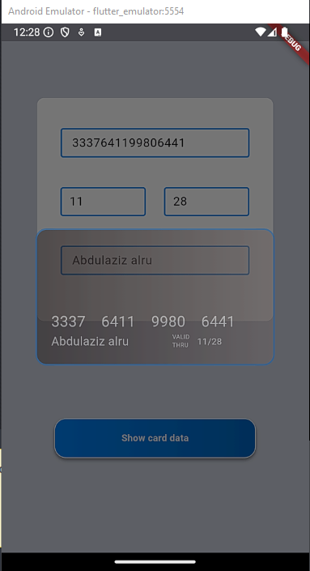

# Flutter Card Info Form

This Flutter project creates a simple UI to input and display credit card information. The application consists of a form that allows users to enter the card number, expiration date, and cardholder name. After filling in the details, the user can click on the "Show card data" button to display the information in a customized `AlertDialog`.

## Widgets Used

### 1. **TextFormField**

- `TextFormField` widgets are used for input fields such as the card number, expiration date, and cardholder name. Validation is applied to ensure the fields are not empty, and specific rules (e.g., length of card number) are enforced.

### 2. **GestureDetector**

- The `GestureDetector` widget detects user interaction, like taps. It is used to trigger the display of the `AlertDialog` when the "Show card data" button is tapped.
- I also used `for loop` to add 4 spaces after every 4 numbers together.

### 3. **AlertDialog**

- The `AlertDialog` widget displays a modal dialog with the formatted card data. It has been customized using a `Container` to achieve a specific appearance, including a gradient background and rounded corners.

### 4. **Opacity**

- The `Opacity` widget is used to adjust the transparency of the `AlertDialog`, providing a semi-transparent effect over the rest of the UI.

### 5. **LinearGradient**

- `LinearGradient` is used within `BoxDecoration` to create gradient color effects for both the form field borders and the "Show card data" button.

### 6. **SizedBox**

- `SizedBox` widgets are used to add fixed spaces between elements, ensuring proper spacing in the layout.

### 7. **BoxShadow**

- The `BoxShadow` is used inside `BoxDecoration` to give the button a shadow, adding depth to the UI.

## How It Works

1. The user fills out the credit card form by entering the card number, expiration date (MM/YY), and the cardholder's name.
2. After filling in the details, the user taps on the "Show card data" button.
3. An `AlertDialog` appears, displaying the entered card information with a styled background and semi-transparent overlay.

This project demonstrates basic form handling, validation, user interaction, and custom styling in Flutter.

# Screen Shots

# 1

# 2

