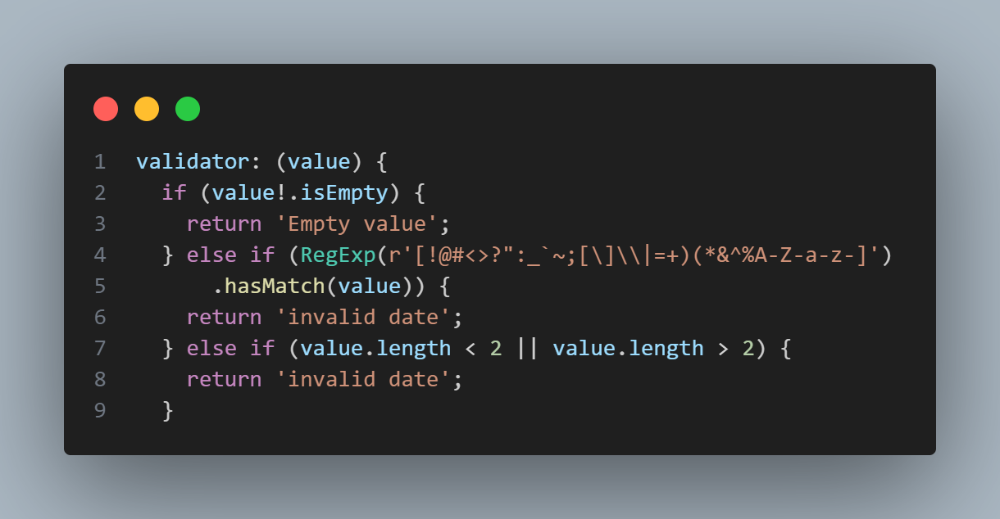
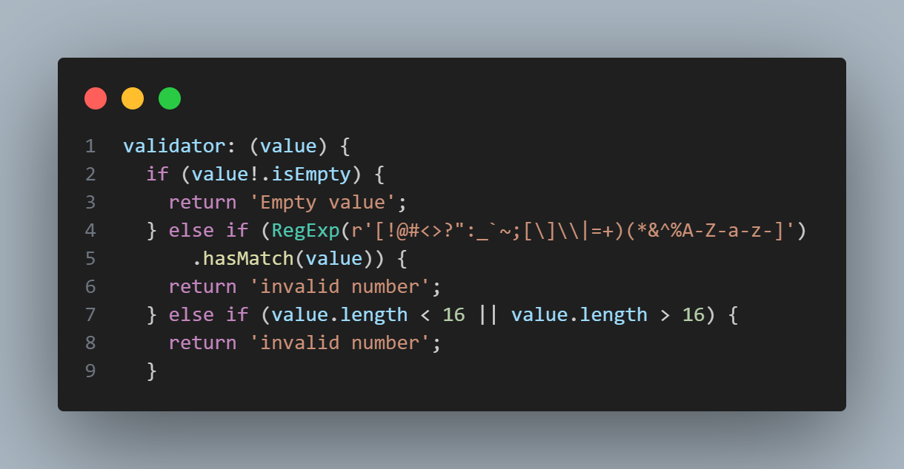
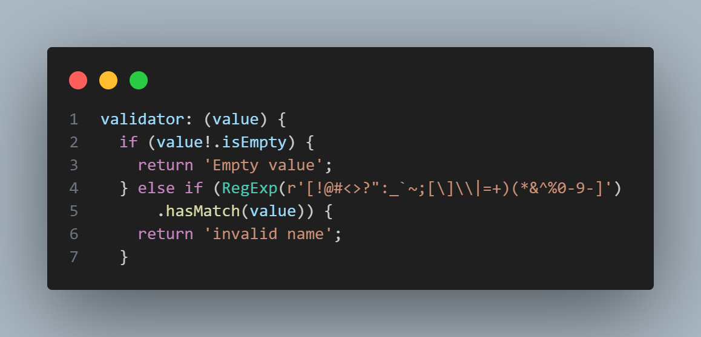
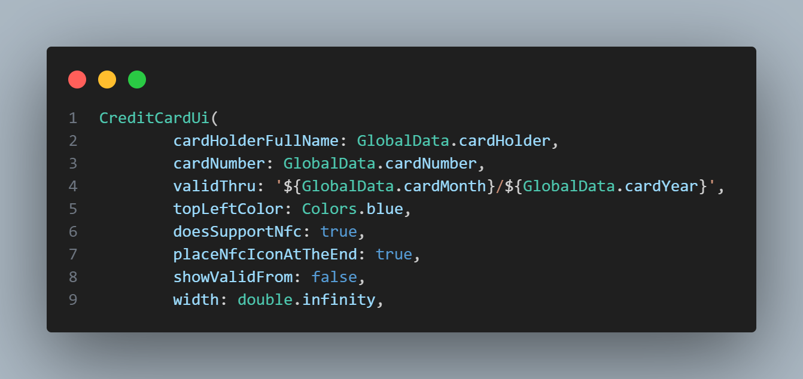
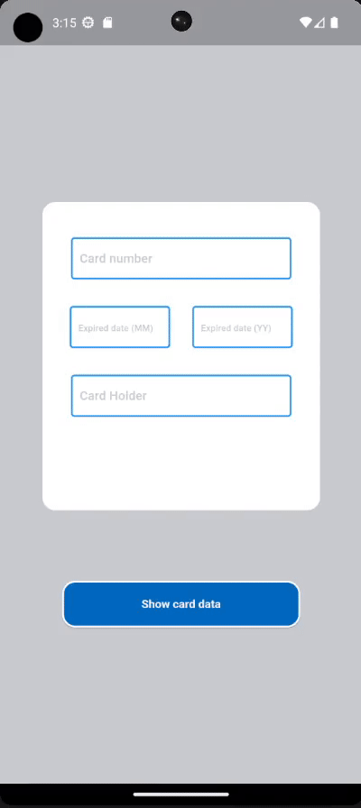

# bank_card_app

A new Flutter project that contain a UI that allows user to create a bank card.

## Main Functionalities

### Text Feild Form
to allows user to provide card info for create it

### Validation user input

#### Validation card date

#### Validation card number

#### Validation card holder

### Card Creation & `GlobalsKey`

## Output

Feel free to use with account name mentioned

by `Basel-75` Github