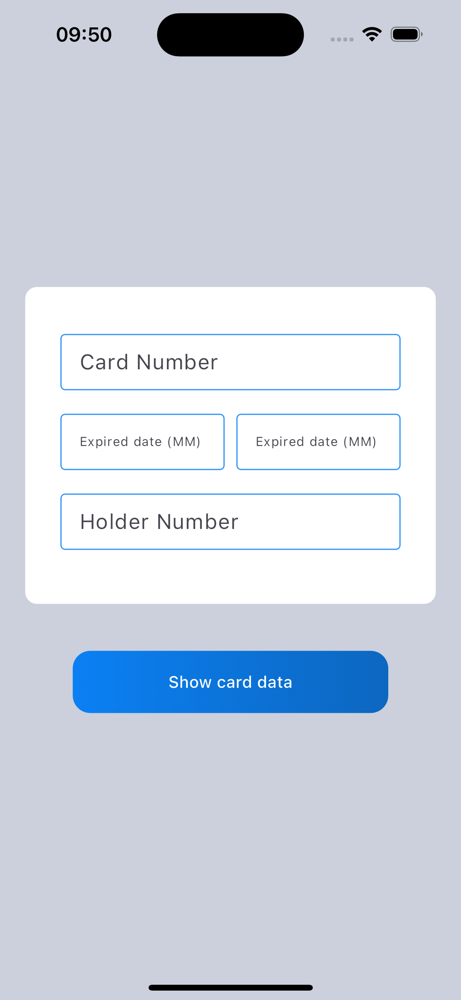
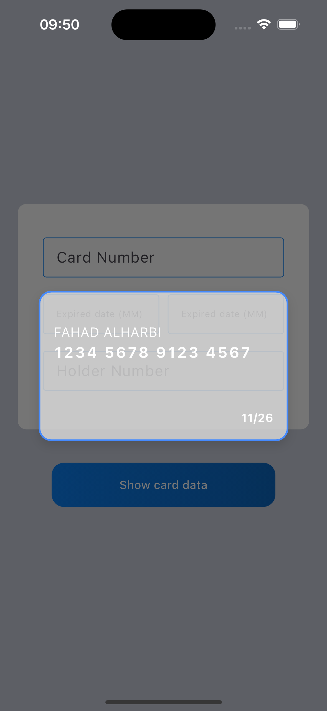

## Assignment-13:

Implement this design in an app using Flutter, using widgets that we take in lesson.

[Desgin in figma:](https://www.figma.com/design/ylPIS03xMTy38uFcR6M6MQ/Assignment-tuwaiq?node-id=0-1&t=GQBf0PyHYMorvihL-1)

## Screenshots

