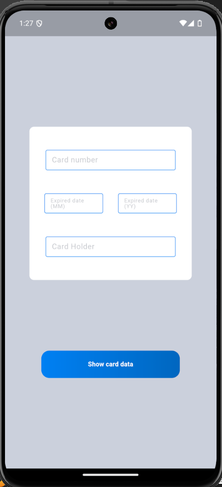
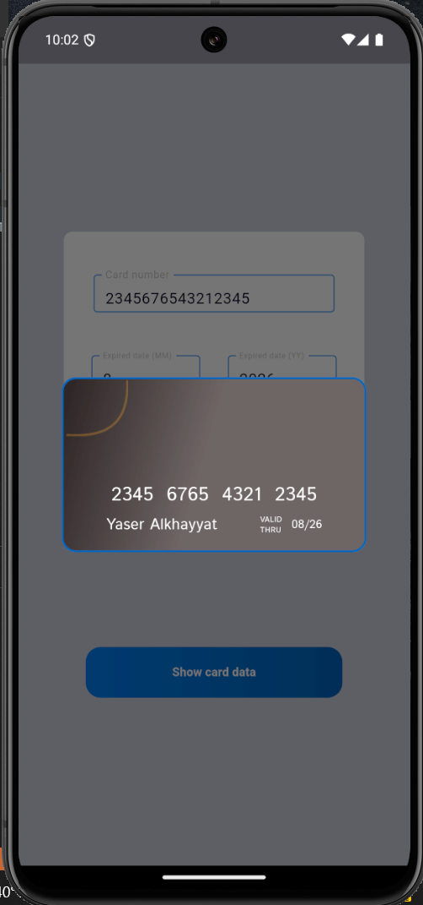
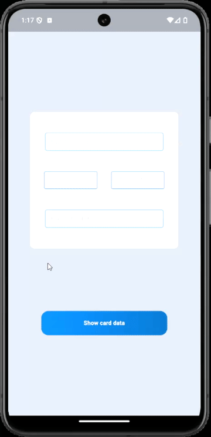

## Assignment 13 : Credit Card 💳💰

### 1. Overview 📖
In this assignment, we are supposed to build flutter application to preview card information after it has been filled by user. The application will include interaction with user in order to fill the card information.

### 2. Widgets Used 🎨
##### 2.1 Built-in Widgets
- **AlertDialog** : used to show the card design
- **LinearGradient** : used to apply gradient colors on widgets

##### 2.2 Custom Widget
- **UserInput** : represents a styled text field, used because all text fields in the app have the same styling.
- **CardInfo** : represents the styled container that showing the credit card.

### 3. Results ⭐

##### 3.1 screenshots

**Main Page**

**Card Info**

##### 3.2 as a gif

### 4. Conclusion 🏁
User input must be handled properly specially if that input is going to be stored in a dataset. That is why we always should validate user input because users are UNPREDICTABLE.

**Author : Yaser Alkhayyat**