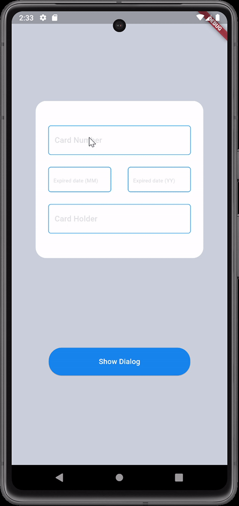

Here is a brief for your README file that describes the two screens built using Flutter:

---

# Credit Card Form and Display Screen in Flutter

This Flutter application consists of one screen: a credit card form screen and a display card as alert.

### Screen shot

### **Screen: Credit Card Form**
This screen contains a form for the user to enter their credit card details such as:
- **Card Number**
- **Expiration Date (MM/YY)**
- **Card Holder's Name**

It includes:

- TextFormFields to capture the user's input for each field.
- Validation: Each field includes built-in validation logic to ensure that the user provides the correct format of information before submitting the form. For example:
- The Card Number must be in the correct format (typically 16 digits).
- The Expiration Date requires proper formatting (MM/YY) and checks for valid future dates.
- The Card Holder's Name must not be empty.

### **Screen 2: Card Information Display**
After the user enters their details in the form and clicks the button, the app transitions to the second screen which visually displays the user's card details. This includes:
- The **Card Number**
- The **Card Holder's Name**
- The **Expiration Date**

This Alert uses:
- **Stack**: To overlay elements and position them accurately on top of one another.
- **Row**: Used to align the text fields horizontally within the card design.
- **Column**: Arranges the form fields vertically.

### **Additional Widget Used**
- **Snackbar**: Provides feedback to the user, such as incorrect inputs.

